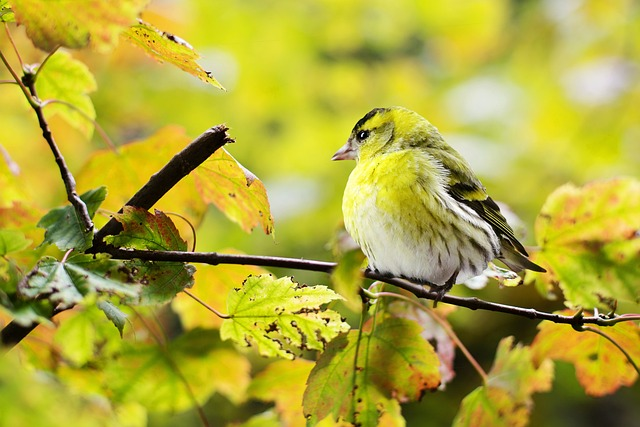
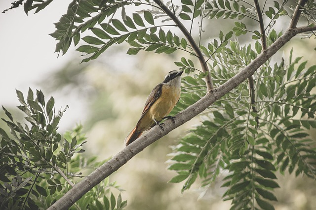
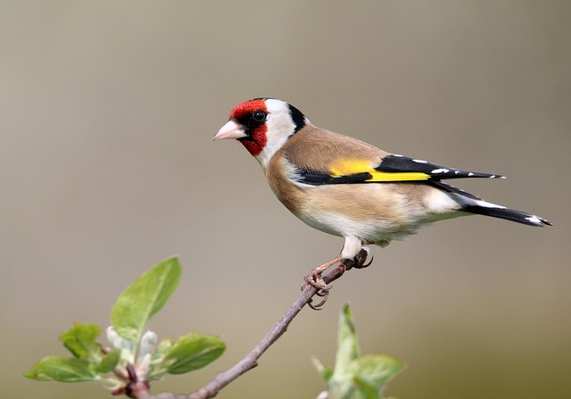
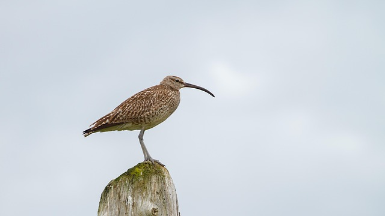

# Google Course: Automating Real-World Tasks with Python
## Module 1 Project
### by Alain Assaf

## Project Purpose:
Use the Python Imaging Library to do the following to a batch of images:
* Open an image
* Rotate an image
* Resize an image
* Save an image in a specific format in a separate directory 

## Original Data
I'm using images downloaded from the [Pixabay](https://pixabay.com) archive which are public domain.

  
*Attribution: [Jill Wellington](https://pixabay.com/users/JillWellington-334088)*

  
*Attribution: [Edgar Sax](https://pixabay.com/users/EdgarSax-22901283)*

  
*Attribution: [Jacek Ben](https://pixabay.com/users/JacekBen-12984472)*

  
*Attribution: [adege](https://pixabay.com/users/adege-4994132)*

## Manipulated Data

# Code details

## Dockerfile
I wrote a simple Dockerfile to create a container using the latest Python version and load the PIL image library.
```Dockerfile
# Use the latest Python image from the Docker Hub
FROM python:latest

# Set the working directory in the container
WORKDIR /app

# Copy the current directory contents into the container at /app
COPY . /app

# Install the Pillow library
RUN pip install --no-cache-dir pillow

# Command to run when the container starts
CMD ["python"]
```

## Container Development
I used VS Code and Docker Desktop for Windows to open the container and connect VS Code to it.  Read my [Docker and Python](https://alainassaf.com/2023-12-19-Cloud-Journey-1-Docker-and-Python/) blog post for more details.

## Python
